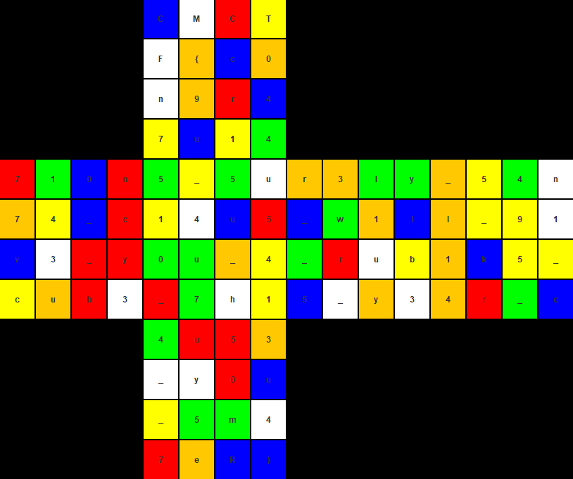

- The first step was to investigate Santa's elf, Mr. Dwarkeshsp.

- In doing so, you're bound to come across his github repo, and consequently the one relating to rubiks-cube-encryption (https://github.com/dwarkeshsp/rubiks-cube-encryption).

- You'll then need to get to grips with this repo, trying to understand it so as to know how to exploit the information provided by the challenge and that of the repo in order to retrieve the flag.

- Files that need tampering are __Main.java__ and __DiffieHellman.java__. Take a closer look at what have I done.

- After compilation, we got this 👇

- Flag was : **CMCTF{c0n9r47u14710n5_5ur3ly_54n74_c14u5_w1ll_91v3_y0u_4_rub1k5_cub3_7h15_y34r_c4u53_y0u_5m47eR}**.